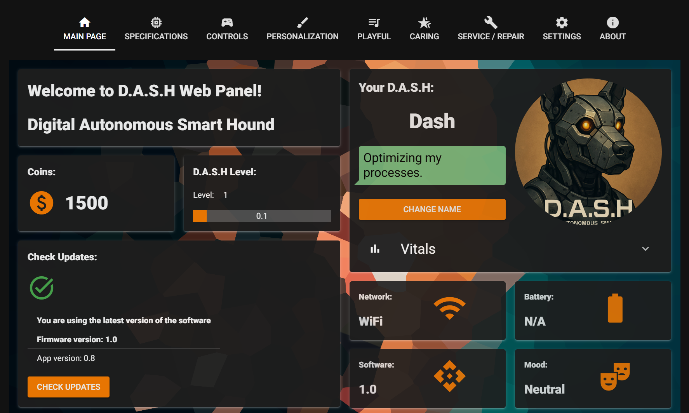

# D.A.S.H Toolkit (Early Alpha)

> **Status:** Actively developed, many features are experimental or in progress.



---

## What is D.A.S.H Toolkit?

D.A.S.H Toolkit is a modern configuration and personalization web panel for the D.A.S.H robot, built with Python and NiceGUI. It allows you to manage settings, monitor system parameters, personalize appearance, and interact with your robot via a user-friendly web interface.

---

## Requirements

- Python 3.8+
- `pip install nicegui psutil`
- (Optional) `pywebview`, other system dependencies
- Linux system recommended for full WiFi/Hotspot support (via `nmcli`)

---

## Main Features

### 1. **Robot Configuration & Personalization**
- Change robot name, language, eye colors, background, and interface mode (desktop/mobile)
- Toggle dark mode
- Change the main theme color
- Select and preview robot profile image and background

### 2. **Network Management**
- Configure WiFi and Hotspot (Linux only, via `nmcli`)
- Switch between WiFi and Hotspot mode (with or without password)
- Automatic hotspot launch based on `config.json` settings
- Save and load network settings

### 3. **System Monitoring**
- Display battery level, CPU temperature, CPU/RAM usage, disk usage
- Live progress bars for each CPU core
- Device specification table (system, version, processor, memory, etc.)
- Real-time stats updates

### 4. **Main Panel & Robot Stats**
- Show current coins, experience level, mood, device ID, and cloud token
- Daily motivational message from the robot (randomized)
- View and edit vital stats (hunger, thirst, happiness)

### 5. **Playful & Caring Modes**
- Tabs with interactive cards (e.g., restaurant, toy shop)
- Simulated purchase of meals and toys
- Animated buttons and cards

### 6. **Power Management**
- Switch CPU power mode (powersave, normal, performance)
- Power mode is saved in `config.json` and applied on startup

### 7. **Service & Info Panel**
- Firmware/software version info, update checks
- Links to GitHub, icon/font resources, and support
- Team presentation

### 8. **Configuration File**
- **All settings are now stored in `config.json`** (no more `data.pkl`/pickle)
- Persistent and easy to edit/backup

### 9. **Daily Coins Bonus**
- The script automatically adds coins to your account every 24 hours (configurable)

### 10. **Language Support (Planned/Experimental)**
- Language files (`lang/en.json`, `lang/pl.json`, etc.) for easy translation and switching
- UI elements can be translated via language files (see code for details)

---

## How to Run

1. Install dependencies:
   ```
   pip install nicegui psutil
   ```
2. Start the app:
   ```
   python main.py
   ```
3. Open your browser and go to the address shown in the console (default: http://localhost:8080)

---

## File Structure

- **main.py** – main application script
- **config.json** – main configuration file (all persistent settings)
- **images/** – backgrounds and profile images
- **lang/** – language files (for future multi-language support)

---

## Roadmap

- Integration with physical D.A.S.H robot (after custom firmware release)
- Expand API for robot control and event handling
- More animations and interactive elements
- Touch/gesture support (e.g., petting, reactions)
- Cloud sync for settings
- Full multi-language support

---

## Authors

UNITRONIX  
[GitHub Project](https://github.com/ers-laboratories/Aibo-Toolkit)

---

**Note:**  
This is an early alpha release – many features are experimental or require a physical D.A.S.H
